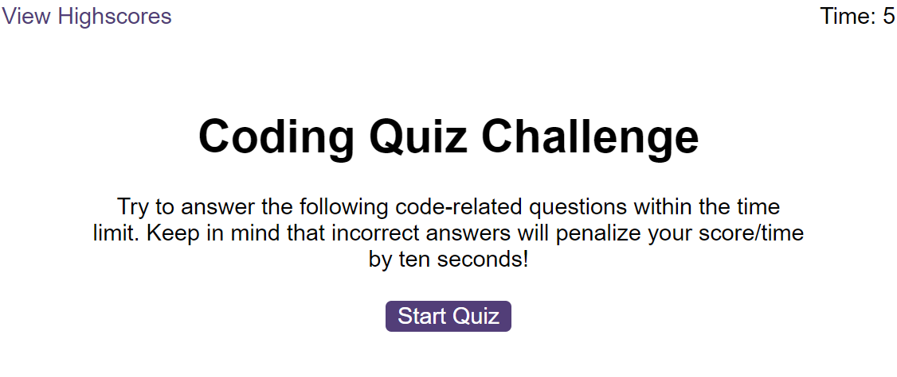
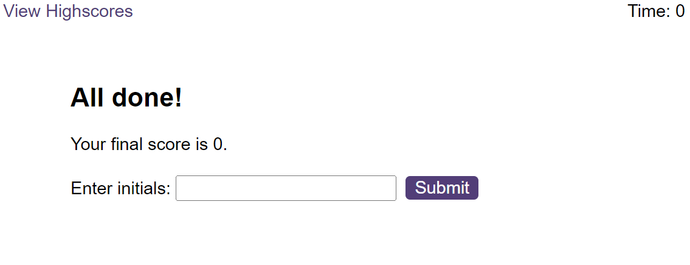
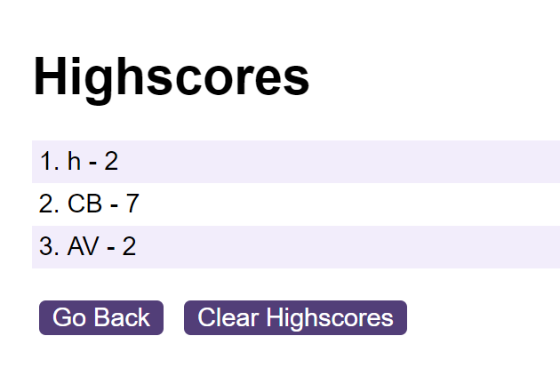

# Code-Quiz-CristianB

Quiz Application - part of Bootcamp challenge

## Description

This Project was created for bootcamp challenge.

It tests the knowledge gained in HTML, CSS and JavaScript during the last weeks, especially the implementation of javascript. It takes an array of objects as questions with one possible correct answer and create a nice webpage that interact with the user, calculate user correct answers to the displayedd question and display the high score at the end. The interaction is timed on timer and every wrong answer penalised the user with 10 seconds. 

This is how it starts:

This is how the questions are displayed:

This is the end screen with the score:

This is the highscore page:

## Installation

The repository is on the GitHub repositories public domain ... and the deployed webpage can be found at ... where it was deployed using GitHub

## Usage

The code is free to be used according to the licence condition (please see the licence file from the GitHub repository)

## Credits

- Bootcamp EDX ( a big cheers for bootcamp teachers! ) provided the needed **materials**, the most wanted **inspiration** and the difficult to obtain **motivation**  

  

- Xpert Learning Assistant - the Bootcamp Course AI, used for helping with some of the javascript syntax
 
         https://bootcampspot.instructure.com/courses

- Markdown Guide used for styling the readme.md

         https://www.markdownguide.org/basic-syntax/

## License

MIT license

